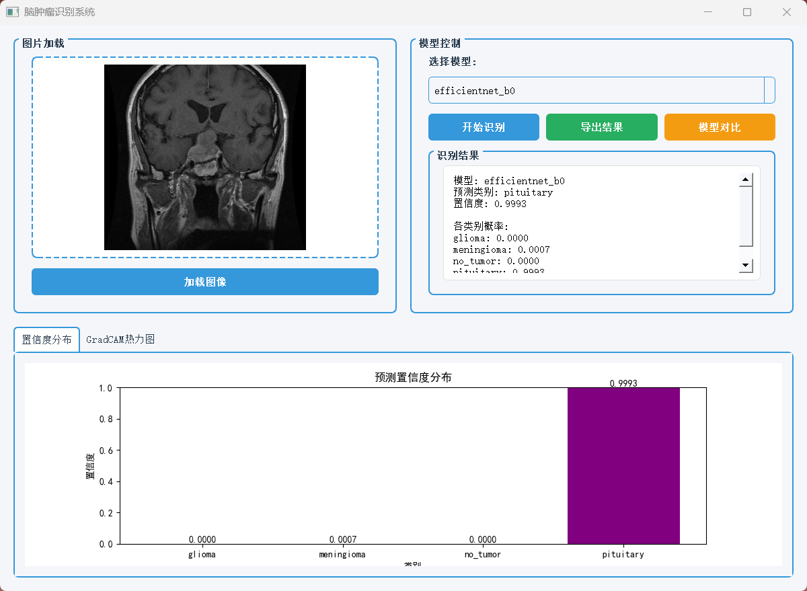
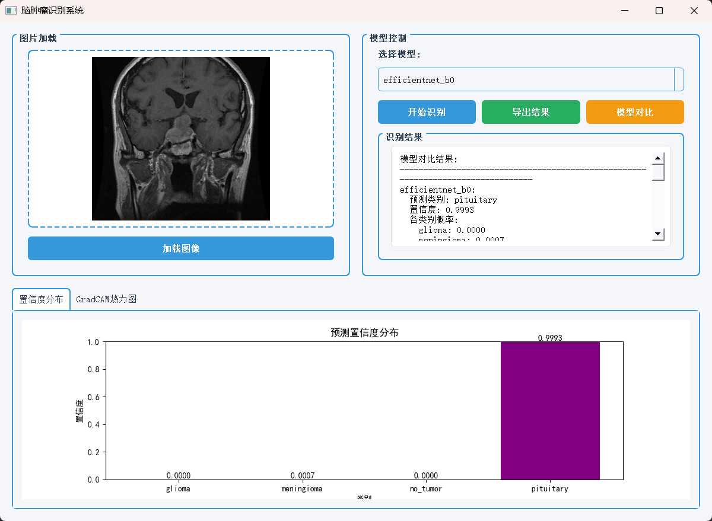
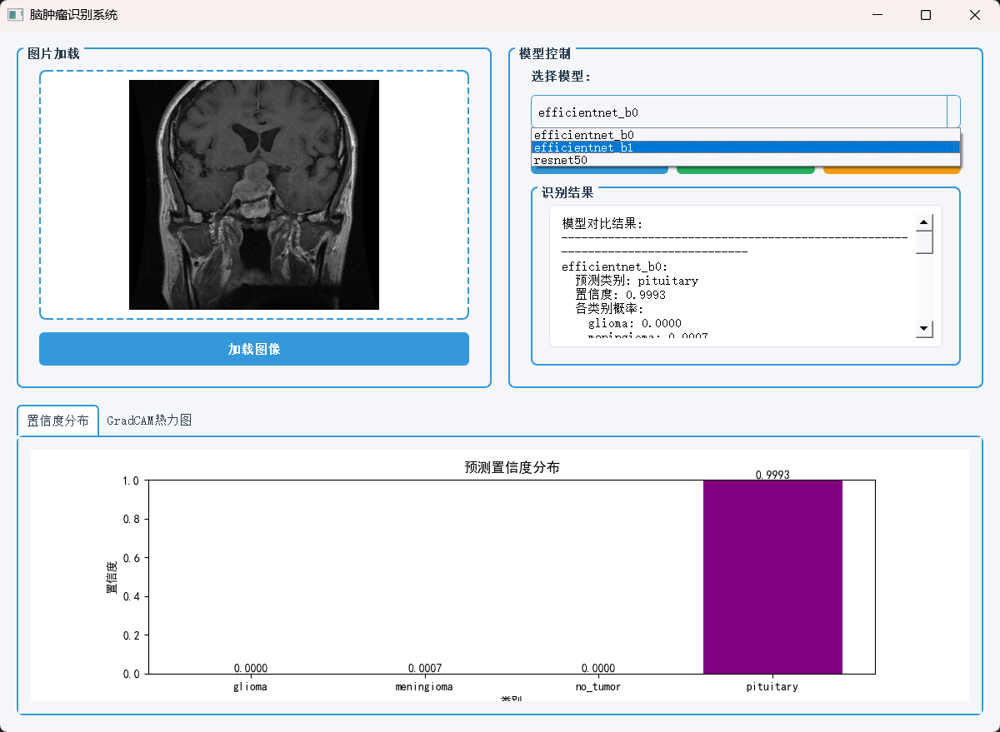
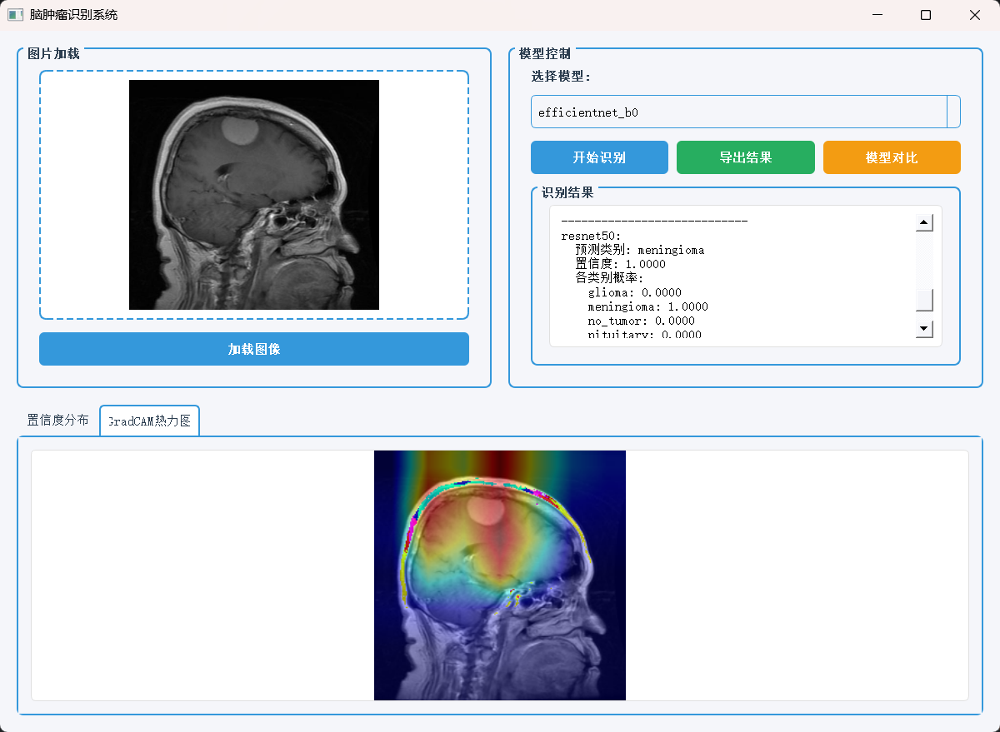

# 脑肿瘤识别系统

基于深度学习的脑肿瘤MRI图像识别系统，支持多种神经网络模型，提供图形化界面进行图像识别和结果分析。

## 功能特性

- **多模型支持**: 支持ResNet50、ResNet34、EfficientNet-B0、EfficientNet-B1等多种深度学习模型
- **图形化界面**: 基于PyQt5的直观用户界面，支持图像加载、模型选择和结果展示
- **智能识别**: 自动识别四种脑肿瘤类型：胶质瘤、脑膜瘤、无肿瘤、垂体瘤
- **可视化分析**:
  - 置信度分布图
  - GradCAM热力图（可解释性分析）
  - 训练过程指标图表
  - 混淆矩阵
- **模型对比**: 支持同时使用多个模型进行预测并对比结果
- **结果导出**: 支持将识别结果导出为文本文件
- **数据增强**: 支持多种数据增强技术提高模型泛化能力
- **早停机制**: 自动监控验证集性能，防止过拟合

## 系统要求

- Python 3.8+
- CUDA 13.0（可选，用于GPU加速）
- Windows/Linux/macOS

## 安装

1. 克隆项目到本地：

```bash
git clone https://github.com/Zzzhher/BrainTumorSystem
cd BrainTumorSystem
```

2. 安装依赖包：

```bash
pip install -r requirements.txt
```

## 项目结构

```
BrainTumorSystem/
├── main.py                 # 程序入口
├── config.yml             # 系统配置文件
├── requirements.txt       # Python依赖包
├── dataset/              # 数据集目录
│   ├── Training/         # 训练集
│   └── Testing/          # 测试集
├── models/               # 模型保存目录
├── results/              # 结果保存目录
│   └── logs/            # 训练日志
└── src/                  # 源代码目录
    ├── train.py         # 训练脚本
    ├── inference.py     # 推理引擎
    ├── dataset.py       # 数据加载与预处理
    ├── utils.py         # 工具函数
    └── ui/              # 用户界面
        ├── main_window.py  # 主窗口
        └── styles.py       # 界面样式
```

## 数据集准备

数据来源：https://www.kaggle.com/datasets/masoudnickparvar/brain-tumor-mri-dataset

## 使用方法

### 1. 训练模型

使用默认模型（ResNet50）训练：

```bash
python src/train.py
```

指定模型训练：

```bash
python src/train.py #默认 resnet50
python src/train.py --model resnet34
python src/train.py --model efficientnet_b0
python src/train.py --model efficientnet_b1
```

训练参数可在 `config.yml` 中配置：

- `batch_size`: 批量大小（默认：32）
- `num_epochs`: 训练轮数（默认：50）
- `learning_rate`: 学习率（默认：0.001）

### 2. 启动图形界面

```bash
python main.py
```

### 3. 使用图形界面

1. **加载图像**: 点击"加载图像"按钮选择MRI图像
2. **选择模型**: 从下拉菜单中选择已训练的模型
3. **开始识别**: 点击"开始识别"按钮进行预测
4. **查看结果**:
   - 识别结果区域显示预测类别和置信度
   - "置信度分布"标签页显示各类别概率条形图
   - "GradCAM热力图"标签页显示模型关注区域
5. **导出结果**: 点击"导出结果"按钮保存识别结果
6. **模型对比**: 点击"模型对比"按钮对比所有模型的预测结果

## 配置说明

`config.yml` 配置文件说明：

```yaml
paths:
  dataset_path: "dataset/Training" # 训练数据集路径
  model_save_path: "models" # 模型保存路径
  log_path: "results/logs" # 日志保存路径
  result_path: "results" # 结果保存路径

model:
  available_models: # 可用模型列表
    - resnet50
    - resnet34
    - efficientnet_b0
    - efficientnet_b1
  default_model: resnet50 # 默认模型

training:
  batch_size: 32 # 批量大小
  num_epochs: 50 # 训练轮数
  learning_rate: 0.001 # 学习率

inference:
  input_size: [224, 224] # 输入图像尺寸

classes: # 类别标签
  - glioma
  - meningioma
  - no_tumor
  - pituitary
```

## 输出说明

训练完成后，系统会生成以下文件：

1. **模型文件**: `models/{model_name}_best.pth` - 最佳模型权重
2. **训练日志**: `results/logs/log_{timestamp}.txt` - 详细训练记录
3. **混淆矩阵**: `results/confusion_matrix_{model_name}.png` - 模型性能可视化
4. **训练指标图**: `results/training_metrics_{model_name}.png` - 训练过程指标

## 技术栈

- **深度学习框架**: PyTorch 2.9.1
- **计算机视觉**: torchvision, OpenCV
- **图像处理**: Pillow, matplotlib
- **图形界面**: PyQt5
- **数据处理**: NumPy, scikit-learn
- **配置管理**: PyYAML
- **进度显示**: tqdm

## 注意事项

1. 首次使用需要先训练模型，或准备预训练模型
2. GPU训练需要安装CUDA和cuDNN
3. 数据集应包含足够的训练样本以获得良好性能
4. GradCAM热力图生成可能需要较长时间
5. 模型对比功能需要至少两个可用模型

## 示例






## 许可证

本项目仅供学习和研究使用。

## 联系方式

如有问题或建议，请通过以下方式联系：

- 提交Issue
- 发送邮件 2142609137@qq.com
